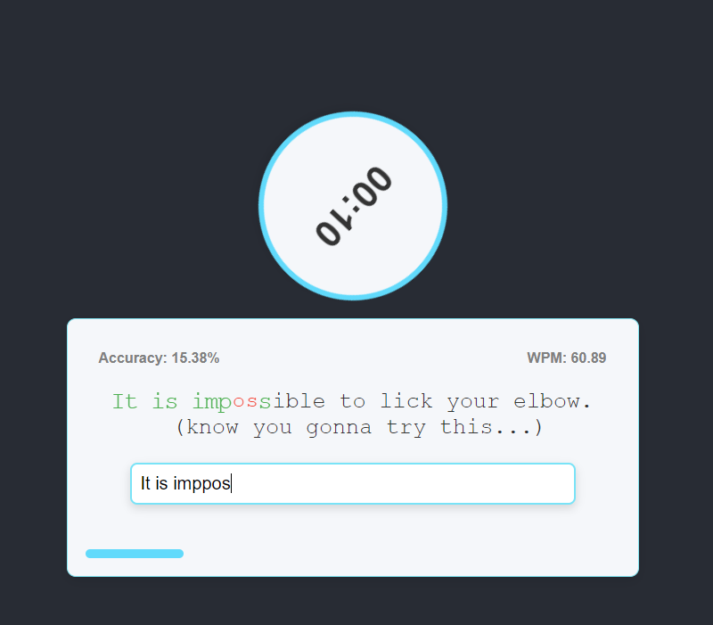

# TypeRace
A typing speed test game built with React.js. Players race against the clock to type a given fact as accurately and quickly as possible. The app displays real-time accuracy and Words Per Minute (WPM) during the race.

# Features
Real-Time Feedback: Displays real-time accuracy and WPM while typing.

Timer Countdown: Players have 15 seconds to complete the race.

Responsive Design: Scales well on various screen sizes.

Interactive UI: The text changes color based on correct or incorrect input.

User-Friendly: Clear and prominent accuracy and WPM indicators.

# Demo

# Technologies Used
React.js: Frontend library for building the user interface.

CSS: Custom styles to enhance the look and feel of the application.

JavaScript: Logic for handling typing and performance metrics.